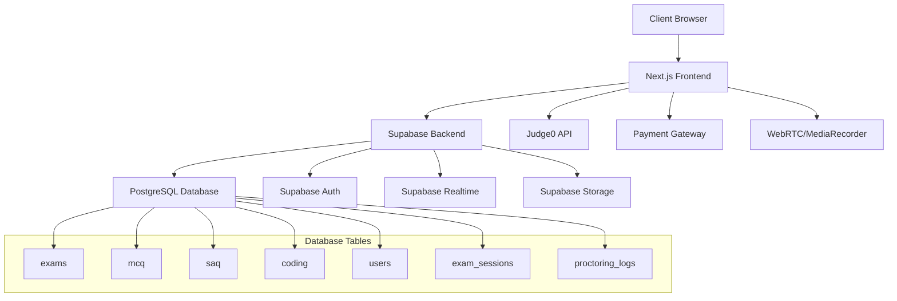
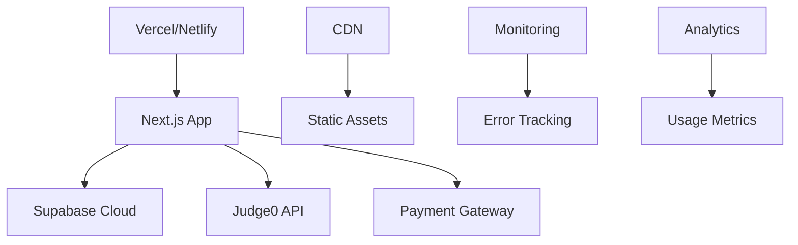

# Design Document - Advanced Online Exam & Assessment Platform

## Overview

The Advanced Online Exam & Assessment Platform is a comprehensive web application built with Next.js 15, Supabase, and modern web technologies. The platform provides secure, feature-rich examination capabilities with real-time proctoring, multiple question types, and advanced analytics.

### Technology Stack

- **Frontend**: Next.js 15 with React 19, TypeScript, Tailwind CSS 4
- **Backend**: Supabase (PostgreSQL, Auth, Real-time, Storage)
- **Animations**: Framer Motion
- **Code Execution**: Judge0 API
- **Payments**: Razorpay/Stripe
- **Proctoring**: WebRTC, MediaRecorder API

## Architecture

### High-Level Architecture



### Application Structure

```
app/
├── (auth)/
│   ├── login/
│   └── register/
├── (dashboard)/
│   ├── teacher/
│   │   ├── exams/
│   │   ├── create-exam/
│   │   ├── grading/
│   │   └── analytics/
│   └── student/
│       ├── exams/
│       ├── results/
│       └── leaderboard/
├── exam/
│   └── [examCode]/
├── api/
│   ├── judge0/
│   ├── payments/
│   └── proctoring/
└── globals.css
```

## Components and Interfaces

### Core Components

#### 1. Authentication Components

- `LoginForm`: Simple email/password authentication with Supabase Auth
- `AdminDashboard`: Super admin interface for creating teacher accounts
- `TeacherCreator`: Component for admin to create new teacher accounts
- `StudentInvitation`: Component for teachers to invite students via email
- `InvitationHandler`: Processes student invitation links and auto-registration
- `AuthGuard`: Route protection based on authentication status
- `RoleGuard`: Role-based access control (admin/teacher/student)

#### 2. Exam Management Components

- `ExamCreator`: Multi-step exam creation wizard
- `QuestionBuilder`: Dynamic question creation for MCQ/SAQ/Coding
- `ExamList`: Display and manage created exams
- `ExamSettings`: Configure exam parameters (duration, timing, access)

#### 3. Assessment Components

- `MCQQuestion`: Multiple choice question interface with option selection
- `SAQQuestion`: Short answer question with rich text editor
- `CodingQuestion`: Code editor with syntax highlighting and execution
- `ExamInterface`: Main exam taking interface with navigation
- `ExamTimer`: Real-time countdown timer with auto-submit

#### 4. Proctoring Components

- `WebcamMonitor`: Webcam feed capture and display
- `TabSwitchDetector`: Browser tab/window focus monitoring
- `ProctorDashboard`: Real-time monitoring interface for teachers
- `ViolationAlert`: Alert system for detected violations

#### 5. Grading Components

- `AutoGrader`: Automatic grading for MCQ and coding questions
- `ManualGrader`: Interface for manual SAQ grading
- `GradingDashboard`: Overview of grading progress
- `ResultsPublisher`: Publish and notify results

#### 6. Analytics Components

- `PerformanceChart`: Visual performance analytics
- `Leaderboard`: Ranking display with filtering
- `ExamStatistics`: Detailed exam analytics
- `StudentProgress`: Individual progress tracking

### Data Models and Interfaces

#### Core Interfaces

```typescript
interface User {
  id: string;
  email: string;
  role: "teacher" | "student" | "admin";
  profile: UserProfile;
}

interface UserProfile {
  id: string;
  user_id: string;
  role: "teacher" | "student" | "admin";
  institution?: string;
  verified: boolean;
  created_at: string;
  updated_at: string;
}

interface Exam {
  id: string;
  title: string;
  description: string;
  exam_code?: string; // Optional for open access
  created_by: string;
  start_time: string;
  end_time: string;
  duration: number;
  total_marks: number;
  is_published: boolean;
  access_type: "invitation" | "code" | "open";
  settings: ExamSettings;
}

interface ExamInvitation {
  id: string;
  exam_id: string;
  student_email: string;
  invitation_token: string;
  status: "pending" | "accepted" | "completed";
  sent_at: string;
  expires_at: string;
}

interface ExamSettings {
  allow_tab_switch: boolean;
  max_violations: number;
  require_webcam: boolean;
  shuffle_questions: boolean;
  show_results_immediately: boolean;
}

interface MCQQuestion {
  id: string;
  exam_id: string;
  user_id?: string;
  question_text: string;
  options: string[];
  correct_option: number;
  selected_option?: number;
  marks: number;
  marks_obtained?: number;
}

interface SAQQuestion {
  id: string;
  exam_id: string;
  user_id?: string;
  question_text: string;
  correct_answer?: string;
  answer_text?: string;
  marks: number;
  marks_obtained?: number;
  grader_comments?: string;
}

interface CodingQuestion {
  id: string;
  exam_id: string;
  user_id?: string;
  question_text: string;
  starter_code?: string;
  expected_output: string;
  submitted_code?: string;
  output?: string;
  marks: number;
  marks_obtained?: number;
  language: string;
  test_cases: TestCase[];
}

interface TestCase {
  input: string;
  expected_output: string;
  is_hidden: boolean;
}

interface ExamSession {
  id: string;
  exam_id: string;
  user_id: string;
  start_time: string;
  end_time?: string;
  status: "in_progress" | "completed" | "terminated";
  violations: ViolationLog[];
}

interface ViolationLog {
  type: "tab_switch" | "webcam_lost" | "suspicious_activity";
  timestamp: string;
  details: any;
}
```

### API Design

#### REST Endpoints

```typescript
// Exam Management
POST /api/exams - Create new exam
GET /api/exams - List user's exams
GET /api/exams/[id] - Get exam details
PUT /api/exams/[id] - Update exam
DELETE /api/exams/[id] - Delete exam

// Exam Participation
POST /api/exams/join - Join exam with code
GET /api/exams/[id]/questions - Get exam questions
POST /api/exams/[id]/submit - Submit exam answers

// Code Execution
POST /api/judge0/execute - Execute code via Judge0
GET /api/judge0/status/[token] - Get execution status

// Grading
GET /api/grading/[examId] - Get grading overview
POST /api/grading/[examId]/grade - Submit grades
POST /api/grading/[examId]/publish - Publish results

// Analytics
GET /api/analytics/exam/[id] - Exam analytics
GET /api/analytics/student/[id] - Student performance
GET /api/leaderboard/[examId] - Exam leaderboard

// Proctoring
POST /api/proctoring/violation - Log violation
GET /api/proctoring/session/[id] - Get session data
```

## Error Handling

### Error Categories

1. **Authentication Errors**

   - Invalid credentials
   - Session expired
   - Insufficient permissions

2. **Exam Access Errors**

   - Invalid exam code
   - Exam not started/ended
   - Already submitted

3. **Technical Errors**

   - Network connectivity issues
   - Code execution failures
   - Webcam access denied

4. **Validation Errors**
   - Invalid form data
   - Missing required fields
   - File upload errors

### Error Handling Strategy

```typescript
interface AppError {
  code: string;
  message: string;
  details?: any;
  timestamp: string;
}

class ErrorHandler {
  static handle(error: AppError): void {
    // Log error
    console.error("Application Error:", error);

    // Show user-friendly message
    toast.error(this.getUserMessage(error.code));

    // Report to monitoring service
    this.reportError(error);
  }

  static getUserMessage(code: string): string {
    const messages = {
      AUTH_INVALID: "Invalid login credentials",
      EXAM_NOT_FOUND: "Exam not found or access denied",
      CODE_EXECUTION_FAILED: "Code execution failed. Please try again.",
      WEBCAM_ACCESS_DENIED: "Webcam access is required for this exam",
    };
    return messages[code] || "An unexpected error occurred";
  }
}
```

## Testing Strategy

### Testing Pyramid

1. **Unit Tests** (70%)

   - Component logic testing
   - Utility function testing
   - API endpoint testing
   - Database query testing

2. **Integration Tests** (20%)

   - Component integration
   - API integration
   - Database integration
   - Third-party service integration

3. **End-to-End Tests** (10%)
   - Complete user workflows
   - Cross-browser testing
   - Performance testing
   - Security testing

### Test Implementation

```typescript
// Example unit test
describe("MCQQuestion Component", () => {
  it("should highlight selected option", () => {
    const { getByRole } = render(
      <MCQQuestion question={mockQuestion} onAnswer={mockOnAnswer} />
    );

    const option = getByRole("radio", { name: "Option A" });
    fireEvent.click(option);

    expect(option).toBeChecked();
    expect(mockOnAnswer).toHaveBeenCalledWith(0);
  });
});

// Example integration test
describe("Exam Submission Flow", () => {
  it("should submit exam and calculate scores", async () => {
    const exam = await createTestExam();
    const session = await startExamSession(exam.id);

    await submitMCQAnswer(session.id, 0, 1);
    await submitExam(session.id);

    const results = await getExamResults(session.id);
    expect(results.total_score).toBeGreaterThan(0);
  });
});
```

### Security Considerations

1. **Authentication & Authorization**

   - JWT token validation
   - Role-based access control
   - Session management
   - Rate limiting

2. **Data Protection**

   - Input sanitization
   - SQL injection prevention
   - XSS protection
   - CSRF protection

3. **Exam Security**

   - Unique exam codes
   - Time-based access control
   - Proctoring validation
   - Answer encryption

4. **Privacy**
   - Webcam data handling
   - GDPR compliance
   - Data retention policies
   - User consent management

### Performance Optimization

1. **Frontend Optimization**

   - Code splitting with Next.js
   - Image optimization
   - Lazy loading
   - Caching strategies

2. **Backend Optimization**

   - Database indexing
   - Query optimization
   - Connection pooling
   - CDN integration

3. **Real-time Features**
   - WebSocket optimization
   - Event debouncing
   - Efficient state management
   - Memory leak prevention

### Deployment Architecture



### Scalability Considerations

1. **Database Scaling**

   - Read replicas for analytics
   - Partitioning for large datasets
   - Connection pooling
   - Query optimization

2. **Application Scaling**

   - Horizontal scaling with containers
   - Load balancing
   - Caching layers
   - Background job processing

3. **Real-time Scaling**
   - WebSocket connection management
   - Event broadcasting optimization
   - Resource cleanup
   - Connection limits
